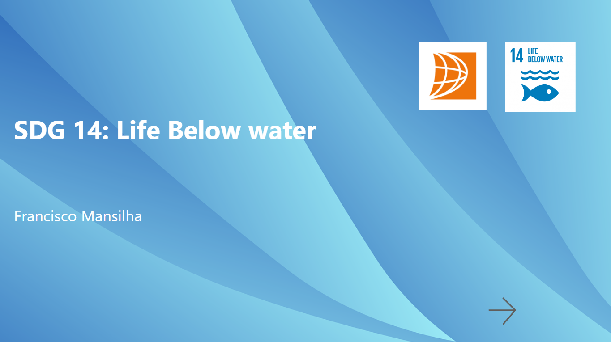
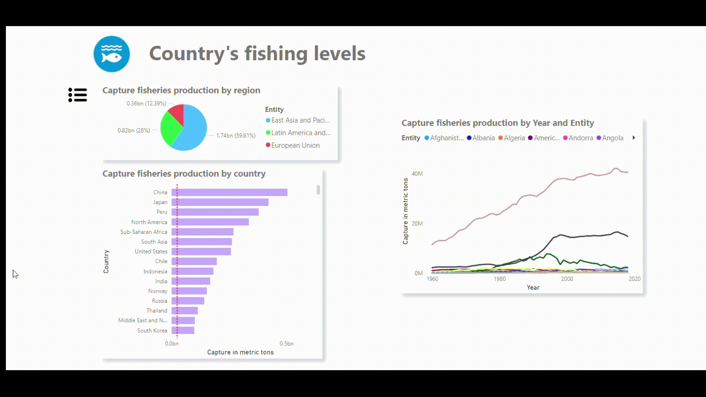
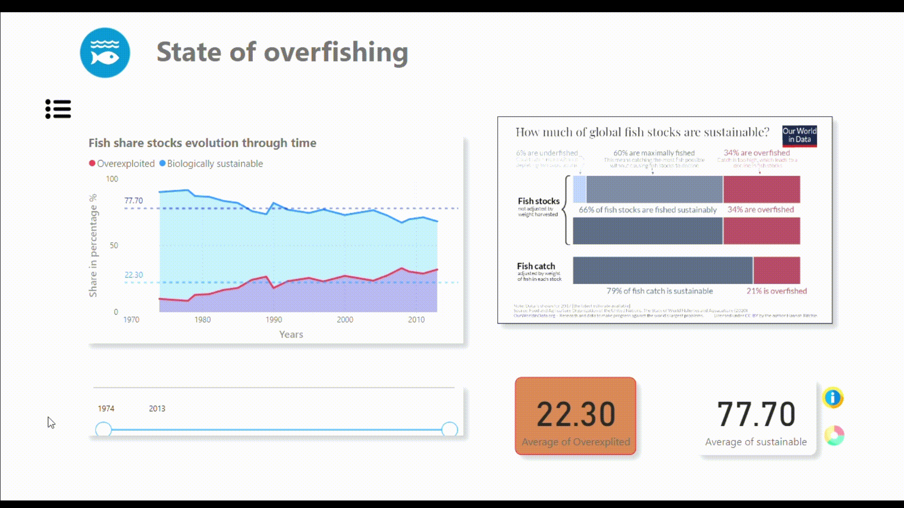
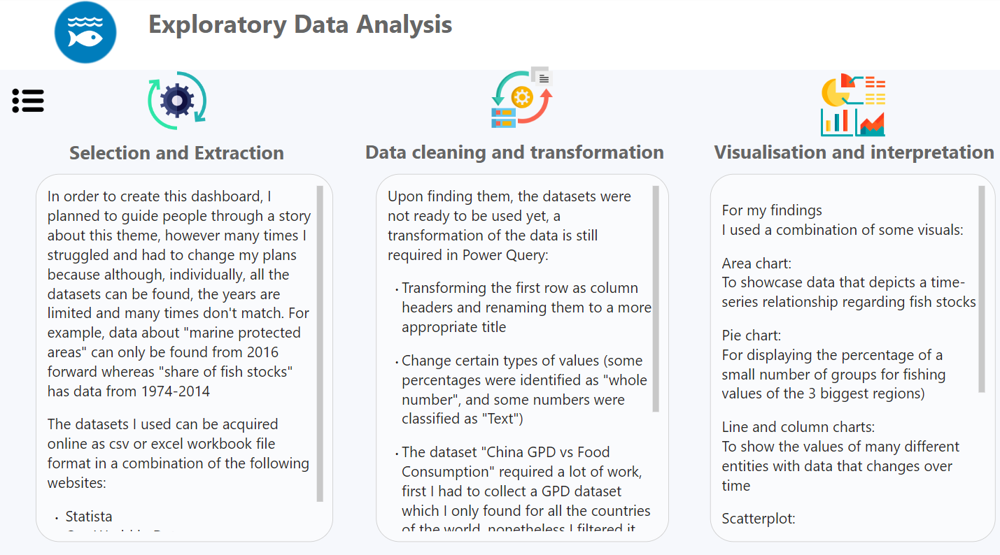

# :wave: Sustainable Development Goal 14 (Life below Water) Dashboard

## 🤓 Project overview

This was my first university project. It was completed in November of 2022, and it was the first time I handled data of such magnitude! 

The objective of this project was to look into the sustainable development goals, find the one that captures our interest the most and use publicly available data and storytelling techniques to answer a problem/question about that particular SDG 

Creating this project helped me learn and develop skills such as:

- Data cleaning
- Data Visualisarion
- Exploratory Data Analysis (EDA)
- Statistics
- Presentation and story-telling
- Power BI

## Problem statements:

What is the __current state of overfishing__ in the world and how can it be __reduced__?

These were the questions that I proposed to answer through an extensive analyse of publicly available data

## How to navigate through this dashboard

### You can follow interactive arrows

---

---

### Or click on this icon

---

---

### To pull a Navigation Pane

---

---

### Some visualisations are also interactive

---

---

### There are dedicated sections EDA, Discussion, Conclusion and more

---

---

Feel free to ask me any question about this project! 😉

You can contact me at:

- francisco.ribeiro.mansilha@gmail.com
- [my linkedin profile](https://www.linkedin.com/in/francisco-mansilha/)
